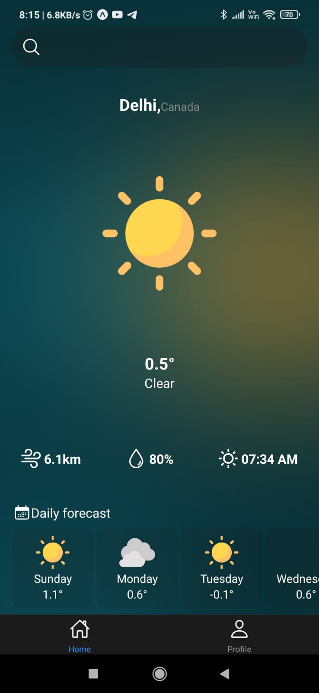

Below is a simple README.md template for your weather app:

---

# Weather App

Welcome to the Weather App! This app allows you to check the weather forecast for different locations.

## Features

- Two tabs: Home and Profile.
- Get weather information using the WeatherAPI.

## Screenshots

### Home Tab

### Profile Tab

## APIs Used

This app uses the [WeatherAPI](https://www.weatherapi.com/) to fetch weather information.

## Getting Started

1. Clone the repository.
2. Install dependencies using `npm install`.
3. Run the app using `npm start`.

## Usage

- Navigate between the Home and Profile tabs to explore weather information and customize your profile settings.
- Use the search feature to find weather forecasts for specific locations.

## Contributing

Contributions are welcome! If you'd like to contribute to this project, please follow these guidelines:

1. Fork the repository.
2. Create a new branch (`git checkout -b feature/new-feature`).
3. Make your changes and commit them (`git commit -am 'Add new feature'`).
4. Push to the branch (`git push origin feature/new-feature`).
5. Create a new Pull Request.

## License

This project is licensed under the [MIT License](LICENSE).
